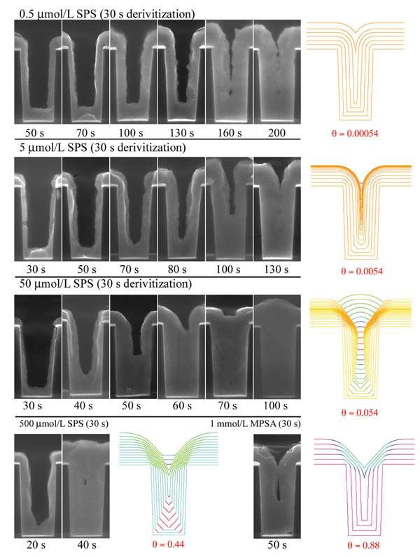
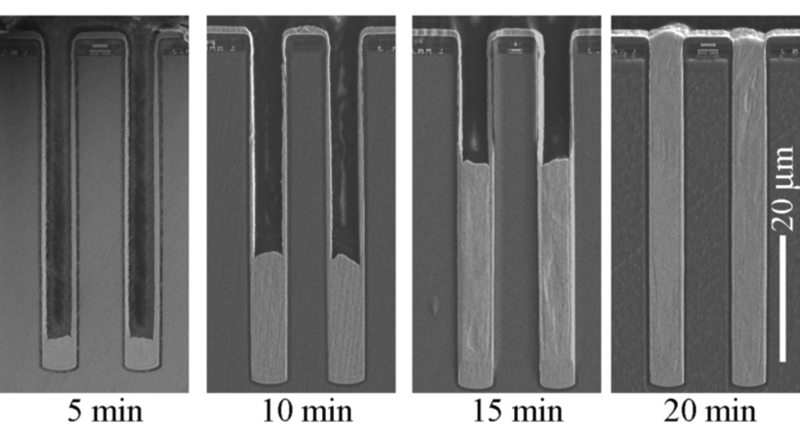
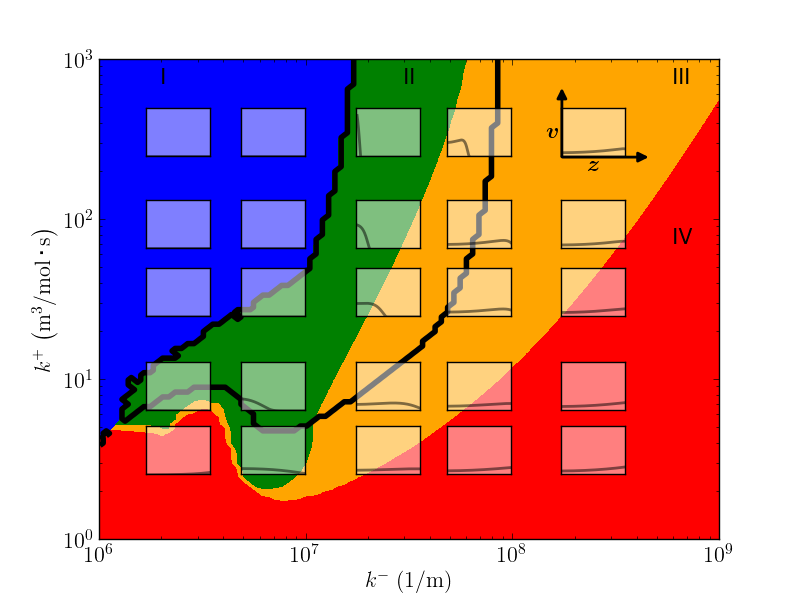

% Modeling Extreme Fill
% Daniel Wheeler
% June 20, 2013

## Super Fill

$\dot{\theta} = \kappa v \theta$

$v = v_0 + v_1 \theta$

## Extreme Fill

$v = v_0 \left(1 - \theta \right)$

$\dot{\theta}= k^+ c_{\theta} \left( 1 - \theta \right) - k^- \theta v$

 

Steady solutions: $\theta=1$ and $\theta = \frac{ k^+ c_{ \theta } } { k^- v_0 }$

## Extreme Fill 1D

<iframe width="480" height="360" src="http://www.youtube.com/embed/opkPA4mXFr4?rel=0" frameborder="0"> </iframe>

$\theta \approx 109.6 \bar{c_{\theta}}$ $\longrightarrow$ $\theta \approx 11.0 \bar{c_{\theta}}$

## Extreme Fill 1D

## Extreme Fill 2D

<iframe width="480" height="360" src="http://www.youtube.com/embed/3I6KU9CymGo?rel=0" frameborder="0"> </iframe>

## Resources

- Research blog: [https://wd15.github.io](https://wd15.github.io)

- Extreme fill 1D: [https://wd15.github.io/extremefill](https://github.com/wd15/extremefill)

- Extreme fill 2D: [https://github.com/wd15/extremefill2D](https://github.com/wd15/extremefill2D)

- Slides: [https://wd15.github.io/2013/06/20/intel](https://wd15.github.io/2013/06/20/intel)

